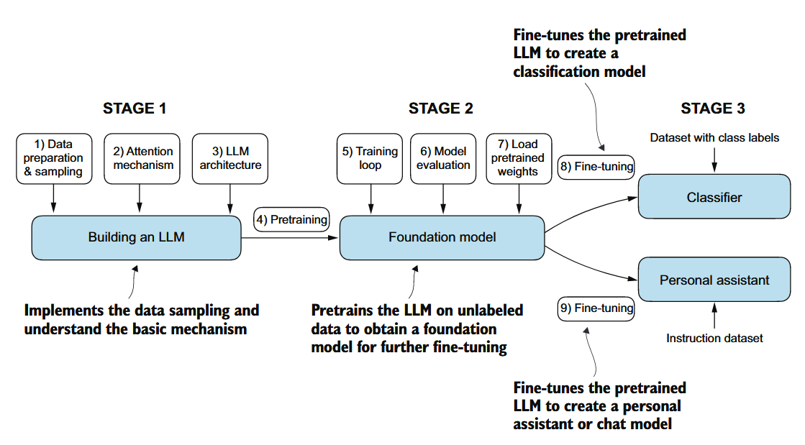

# Chapter 1 Understanding Large Language Models
## Main Chapter Code
There is no code in this chapter

1. 了解基本数据的处理步骤，编写注意力机制
2. 学习如何编码并且预训练一个类似GPT的LLM，这个LLM可以生成新文本。同时我们还学习如何评估一个模型，最后加载预训练好的权重
3. 最后阶段，我们将进行fine-tune